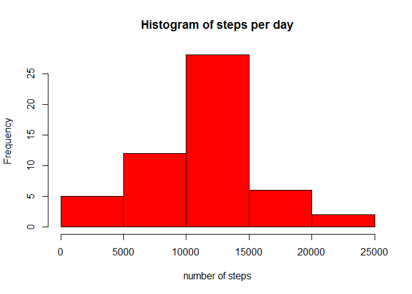
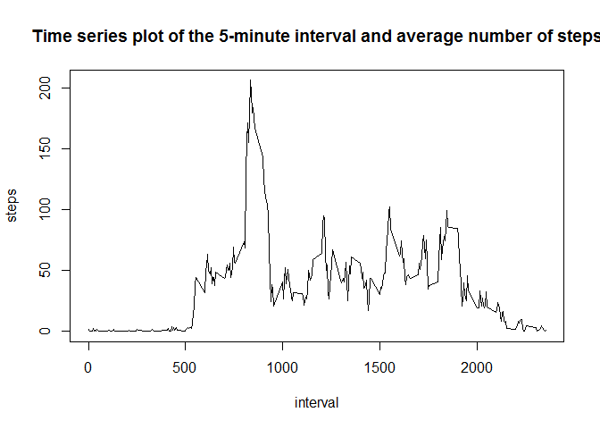
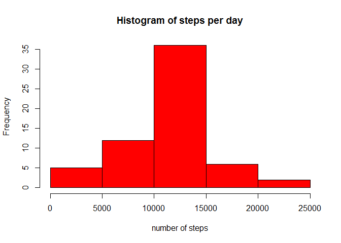

# Reproducible Research : Peer Assessment 1
Roberta Justo  
Sunday, September 20, 2015  

Loading and preprocessing the data
===

```r
echo=TRUE
```

```r
data<- read.csv("activity.csv")
head(data)
```

```
##   steps       date interval
## 1    NA 2012-10-01        0
## 2    NA 2012-10-01        5
## 3    NA 2012-10-01       10
## 4    NA 2012-10-01       15
## 5    NA 2012-10-01       20
## 6    NA 2012-10-01       25
```

What is mean total number of steps taken per day?
===

1. Calculate the total number of steps taken per day


```r
library("dplyr")
```

```
## 
## Attaching package: 'dplyr'
## 
## The following objects are masked from 'package:stats':
## 
##     filter, lag
## 
## The following objects are masked from 'package:base':
## 
##     intersect, setdiff, setequal, union
```

```r
library(ggplot2)

steps_per_day <- summarise(group_by(data,date), steps = sum(steps))
```
2. Make a histogram of the total number of steps taken each day


```r
hist(steps_per_day$steps, 
     col = "red1", 
     main = "Histogram of steps per day", 
     xlab = "number of steps")
```

 

3. Calculate and report the mean and median of the total number of steps taken per day

Mean

```r
mean_steps<- mean(steps_per_day$steps, na.rm=TRUE)
mean_steps
```

```
## [1] 10766.19
```
Median

```r
median_steps<- median(steps_per_day$steps, na.rm=TRUE)
median_steps
```

```
## [1] 10765
```


What is the average daily activity pattern?
===

1. Make a time series plot (i.e. type = "l") of the 5-minute interval (x-axis) and the average number of steps taken, averaged across all days (y-axis)


```r
average_per_interval <- summarise(group_by(data,interval), steps = mean(steps, na.rm=TRUE))

plot(average_per_interval$steps ~average_per_interval$interval, 
     type="l", xlab = "interval", ylab = "steps", main="Time series plot of the 5-minute interval and average number of steps")
```

 

2. Which 5-minute interval, on average across all the days in the dataset, contains the maximum number of steps?


```r
average_per_interval[which.max(average_per_interval$steps),]
```

```
## Source: local data frame [1 x 2]
## 
##   interval    steps
## 1      835 206.1698
```


Imputing missing values
===

Note that there are a number of days/intervals where there are missing values (coded as NA). The presence of missing days may introduce bias into some calculations or summaries of the data.

1. Calculate and report the total number of missing values in the dataset (i.e. the total number of rows with NAs)


```r
sum(is.na(data$steps))
```

```
## [1] 2304
```

2. Devise a strategy for filling in all of the missing values in the dataset. The strategy does not need to be sophisticated. For example, you could use the mean/median for that day, or the mean for that 5-minute interval, etc.

3. Create a new dataset that is equal to the original dataset but with the missing data filled in.
My strategy is to use the mean for the 5-minute interval.


```r
subs.na <- function(steps, interval) {
        subs <- NA
        if (!is.na(steps))
                subs <- c(steps)
        else
                subs <- (average_per_interval[average_per_interval$interval==interval, "steps"])
        return(subs)
}
okdata <- data
okdata$steps <- mapply(subs.na, okdata$steps, okdata$interval)

sum(is.na(okdata$steps))
```

```
## [1] 0
```

4. Make a histogram of the total number of steps taken each day.

```r
okdata$steps <- as.numeric( as.character( okdata$steps ) )

steps_day_ok <- summarise(group_by(okdata,date), steps = sum(steps))

hist(steps_day_ok$steps, 
     col = "red1", 
     main = "Histogram of steps per day", 
     xlab = "number of steps")
```

 

Calculate and report the mean and median total number of steps taken per day.  
Mean


```r
mean_steps_ok<- mean(steps_day_ok$steps)
mean_steps_ok
```

```
## [1] 10766.19
```
Median


```r
median_steps<- median(steps_day_ok$steps)
median_steps
```

```
## [1] 10766.19
```
Do these values differ from the estimates from the first part of the assignment? What is the impact of imputing missing data on the estimates of the total daily number of steps?
We can see that the mean is the same and the median was 10765 and now is 10766.19. This increase hapened because of the process that I adopted by replacing NAs by the interval mean.


Are there differences in activity patterns between weekdays and weekends?
===

For this part the weekdays() function may be of some help here. Use the dataset with the filled-in missing values for this part.

1. Create a new factor variable in the dataset with two levels - "weekday" and "weekend" indicating whether a given date is a weekday or weekend day.


```r
okdata$weekdays <-factor(weekdays(as.Date(okdata$date)))
levels(okdata$weekdays)
```

```
## [1] "domingo"       "quarta-feira"  "quinta-feira"  "sábado"       
## [5] "segunda-feira" "sexta-feira"   "terça-feira"
```

```r
levels(okdata$weekdays) <- list(weekday = c("segunda-feira", "terça-feira", "quarta-feira",                                        "quinta-feira", "sexta-feira"), weekend = c("sábado", "domingo"))
levels(okdata$weekdays)
```

```
## [1] "weekday" "weekend"
```

```r
steps_weekday <- summarise(group_by(okdata,weekdays, interval), steps = mean(steps))
```

2. Make a panel plot containing a time series plot (i.e. type = "l") of the 5-minute interval (x-axis) and the average number of steps taken, averaged across all weekday days or weekend days (y-axis). 


```r
library(lattice)

xyplot(steps_weekday$steps ~steps_weekday$interval | steps_weekday$weekdays, 
     layout = c(1, 2),
     type="l", xlab = "interval", ylab = "steps")
```

 
